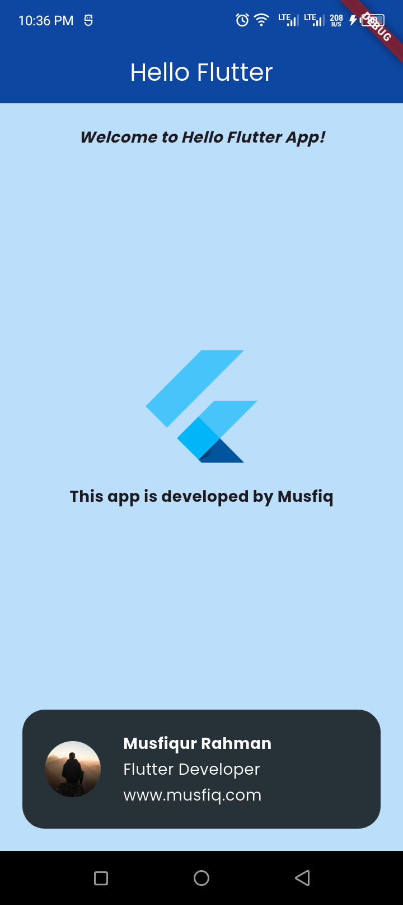

# Hello Flutter App

This is a simple Flutter application developed by Musfiqur Rahman. The app showcases a basic UI with three child widgets.

## Features

- **ChildOne**: Displays a welcome message.
- **ChildTwo**: Shows an image and a text message.
- **ChildThree**: Displays a profile card with an image, name, title, and website.

## Screenshots



## Getting Started

To get started with this project, follow these steps:

### Prerequisites

- Flutter SDK: [Install Flutter](https://flutter.dev/docs/get-started/install)
- Dart SDK: Included with Flutter
- Android Studio or any preferred IDE

### Installation

1. Clone the repository:

```sh
git clone https://github.com/musfiqur552608/Hello-Flutter-App.git
cd Hello-Flutter-App
```

### Install dependencies:
flutter pub get

### Run the app:
flutter run

### Project Structure:
lib/
├── child_one.dart
├── child_two.dart
├── child_three.dart
└── mycontainer.dart

### Contributing
Contributions are welcome! Please fork the repository and create a pull request with your changes. 

### Author
Musfiqur Rahman